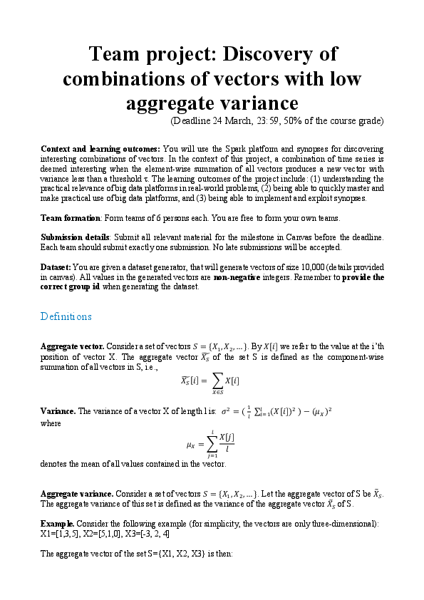
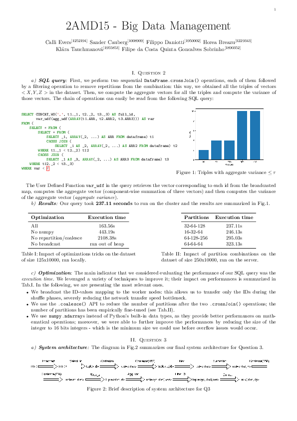
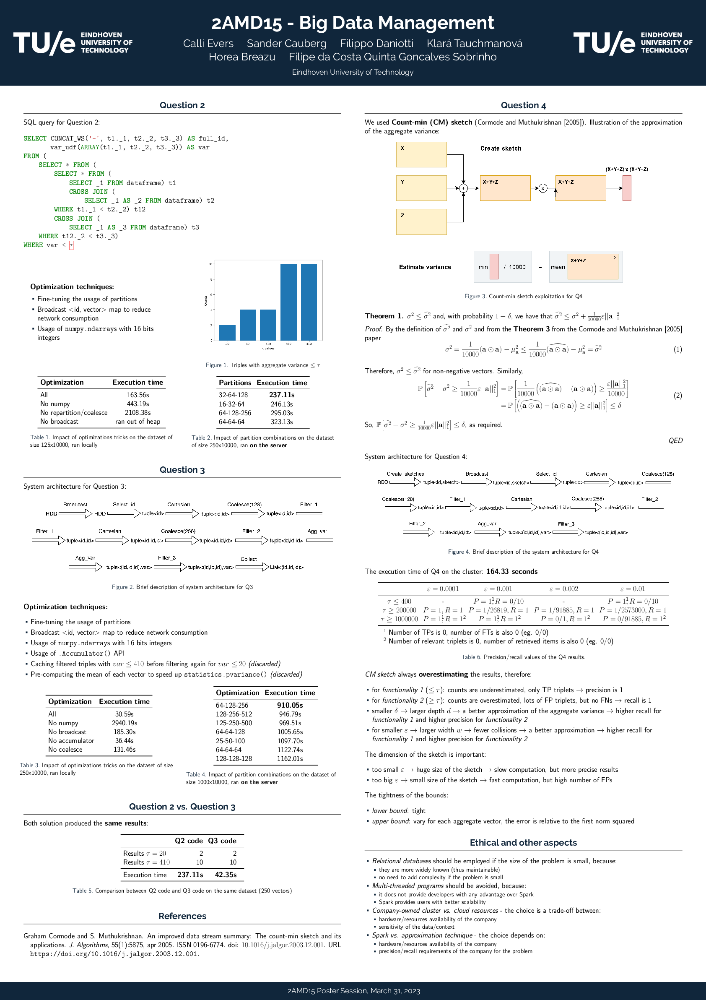

# Distributed Aggregate Variance

This repo contains the code and documentation for the project of the course *2AMD15 - Big Data Management* held at TU/e by Prof. Odysseas Papapetrou during the AY 2022/2023

The goal of the project is to use the Spark platform to discover interesting combinations of vectors from a large dataset in a cloud distributed setting, more details in the [problem description](docs/2022-23%202AMD15%20project.pdf)

Our results are summarized in [the poster](docs/poster/main.pdf) and described in-depth in [the report](docs/report/main.pdf)

## Outline

| <a href="docs/2022-23 2AMD15 project.pdf" target="_blank"><b>Problem description</b></a> | <a href="docs/report/main.pdf" target="_blank"><b>Report</b></a> | <a href="docs/poster/main.pdf" target="_blank"><b>Poster</b></a> |
|--------------------------------------------------------------------------------------------------------------------------|---------------------------------------------------------------------------------------------------------------------------------|--------------------------------------------------------------------------------------------------------------------------------|
|  <a href="docs/2022-23 2AMD15 project.pdf" target="_blank"></a>              | <a href="docs/report/main.pdf" target="_blank"></a>         | <a href="docs/poster/main.pdf" target="_blank"></a>       |


## How to use

### Run locally

In order to run on your machine

* generate a `vector.csv` dataset with the `GenVec.jar` utility (see [here](tools/GenVec/))
* run `python3 ./src/2amd15/main.py`

### Submit to server

In order to prepare for the submission, a `app.zip` needs to be uploaded to the server, and such archive should contain one single `main.py` file. The data should be contained in a `data.zip` archive. Only one question per submission can be uploaded and tested.

The `submit.py` module takes care of prepare the aforementioned submission artifacts. Here is how to use it:
```
usage: submit.py [-h] [-s] -q {2,3,4} [-p PASSWORD] [-v] [-r ROWS] [-c COLS] [-f]

Handles the building pipeline of the submission artifact.

options:
  -h, --help            show this help message and exit
  -s, --submit          Proceed with creating a submission on the server after build
  -q {2,3,4}, --question {2,3,4}
                        which question is the submission artifacts about
  -p PASSWORD, --password PASSWORD
                        password of the server, required if -s is passed
  -v, --verbose         verbose flag, sets logging level to debug
  -r ROWS, --rows ROWS  number of vectors in the csv, overwrites default
  -c COLS, --columns COLS
                        length of vectors in the csv, overwrites default
  -f, --full-build      builds a main.py with full code
```

For instance, here is how you prepare the artifacts and submit for question 3 with reduced dataset:

* Unix
```bash
python3 ./tools/submit.py -q 3 -s -r 250
```
* Win
```cmd
python .\tools\submit.py -q 3 -s -r 250
```

### Connect to server

It is possible to connect to the server via `sft` with the following script and then typing in the password

* Unix
```bash
./tools/server/connect.sh
```
* Win
```cmd
.\tools\server\connect.bat
```

## Template information

Description of the project template from the lecturer

> This is a template project for team project of 2AMD15 2023.
> 
> Various comments in the main.py file indicate where functionality needs to be implemented.
> These comments are marked TODO.
> 
> You are allowed to change the layout of the main.py file (such as method names and signatures) in any way you like,
> and you can add new functionality (possibly in new .py files). Do make sure that there exists a file called "main.py"
> which contains the 'main module statement' of the form "if __name__ == '__main__':".
>
> You can ZIP the main.py file along with any other .py files using any common compression tool. The archive should
> be called app.zip and can be uploaded as such to the server.
> 
> Good luck on the project!
